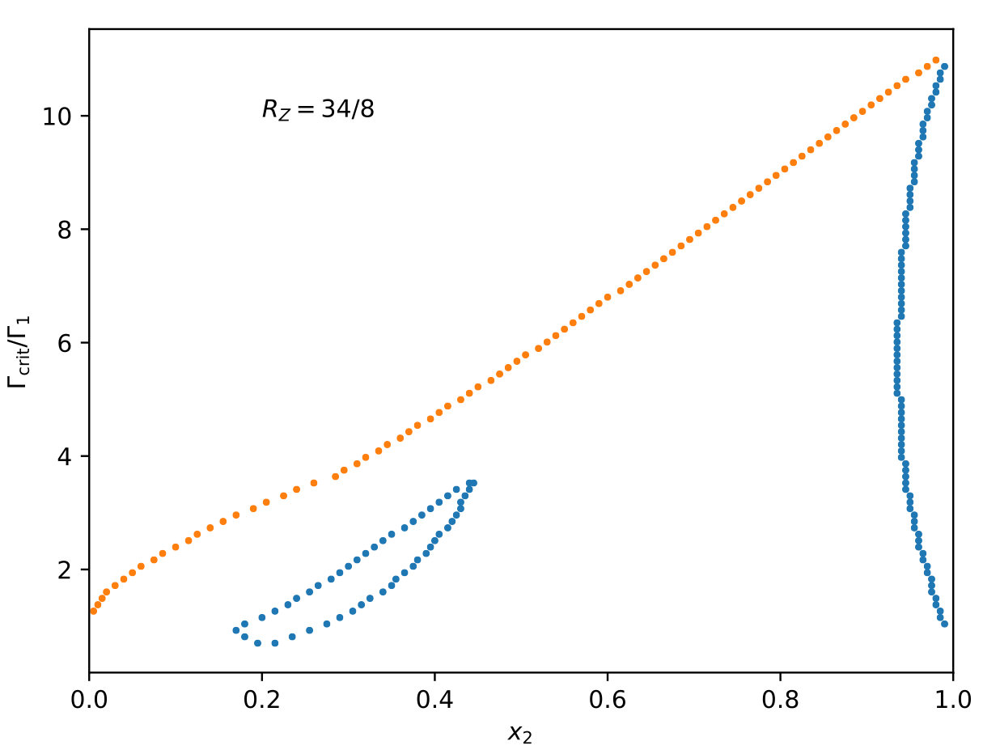

Calculates the phase diagram for two component plasmas following [Medin & Cumming (2010)](http://adsabs.harvard.edu/abs/2010PhRvE..81c6107M).

`free_energy.py` computes the free energy of liquid and solid phases

`phase_diagram.py` computes the phase diagram by searching for tangent points at different Gamma's

